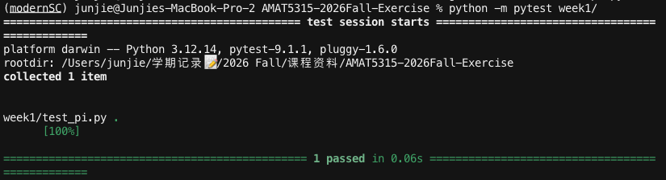

# AMAT5315-2026Fall-Exercise

Public weekly exercises for [AMAT5315-2026Fall: Modern Scientific Computing](https://giggleliu.github.io/AMAT5315-2026Fall/index.html) at HKUST(GZ). Owner: Junjie LEI

Work for each week lives in `week1/`, `week2/`, `week3/`, and so on. Week 1 estimates π by throwing random darts in the unit square.

## Install pytest

Python 3.10 or newer is required. This repo uses the conda environment `modernSC`:

```bash
conda create -n modernSC python=3.12
conda activate modernSC
python -m pip install pytest pypdf
```

If `modernSC` already exists, only the last two lines are needed.

## Run the test

From the repository root:

```bash
conda activate modernSC
python -m pytest week1/
```

Expected: `1 passed`.


