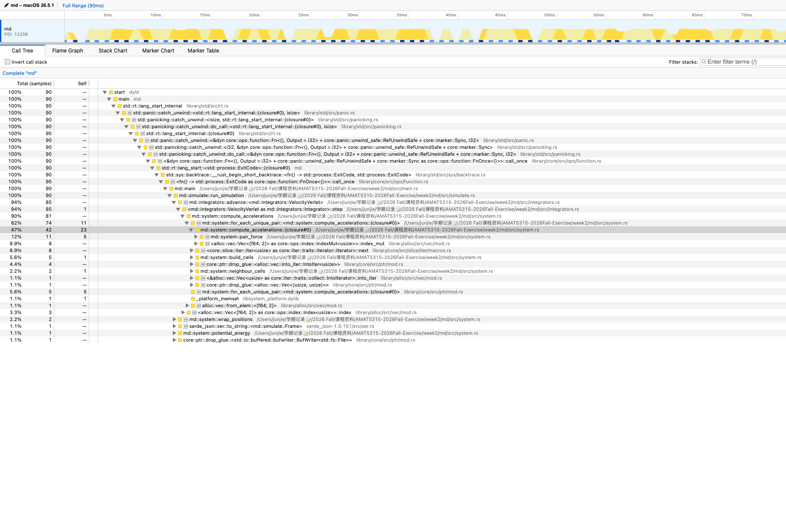
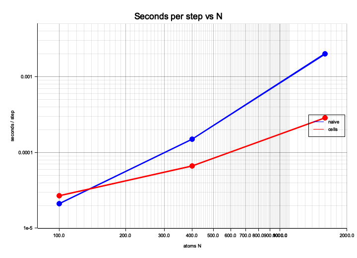

# Week 2: Molecular dynamics

Simulator crate: `md/`. From this directory, `make reproduce` runs the default \(N=100\) fluid.

Install the release binary (with debug info for `samply`) onto `PATH`:

```bash
cargo install --path md --force
```

## Timing

Contract run (\(N=100\), 2000 equilibration + 10000 production steps). Three wall-clock runs each; median and min–max. Debug is `cargo build` then `./md/target/debug/md`. Release is the installed `md`. NumPy is `week2-sim.py` in conda env `modernSC`.

```bash
/usr/bin/time -p conda run -n modernSC python week2-sim.py
cargo build --manifest-path md/Cargo.toml
/usr/bin/time -p ./md/target/debug/md run --out /tmp/md-debug
/usr/bin/time -p md run --out /tmp/md-release
```

| Program | Median (s) | Range: min–max (s) |
| --- | ---: | ---: |
| NumPy week2-sim.py | 4.14 | 4.05–6.31 |
| Rust debug | 2.05 | 2.05–2.52 |
| Rust release | 0.13 | 0.13–0.13 |

Release is well under one third of debug. On this machine the release Rust also beats NumPy.

## Profile

\(N=400\), `--eq-steps 200 --steps 1000`. Force share is samples in `compute_accelerations` and its callees. Naive used `--force naive`; cell list is the default after `cargo install --path md`.

```bash
samply record --save-only -o /tmp/md-naive-profile.json -- md run --force naive --n 400 --eq-steps 200 --steps 1000 --out /tmp/md-prof
samply record --save-only -o /tmp/md-cells-profile.json -- md run --n 400 --eq-steps 200 --steps 1000 --out /tmp/md-prof
samply load /tmp/md-cells-profile.json
```

| Version | Force share (%) | Elapsed time (s) |
| --- | ---: | ---: |
| Naive | 92 | 0.18 |
| Cell list | 90 | 0.07 |




The naive hot spot is `md::system::compute_accelerations` (all-pairs search). After the cell list the same function still dominates the share of a shorter run (90 ms vs 181 ms).

## Benchmark

`md run --force naive` vs default `--force cells` at `--steps 500 --eq-steps 100` (600 steps). Three wall-clock runs each (`time.perf_counter` around the process). Speedup = naive / cells.

```bash
python3 - <<'PY'
# see the three-run loop recorded with the table below
PY
cargo run --manifest-path md/Cargo.toml --release --example scaling
```

| N | naive median (s) | naive range (s) | cells median (s) | cells range (s) | speedup |
| ---: | ---: | ---: | ---: | ---: | ---: |
| 100 | 0.0126 | 0.0123–0.0226 | 0.0161 | 0.0146–0.0175 | 0.78 |
| 400 | 0.0899 | 0.0892–0.0902 | 0.0397 | 0.0397–0.0406 | 2.26 |
| 1600 | 1.201 | 1.196–1.215 | 0.1725 | 0.1720–0.1739 | 6.96 |



Naive seconds per step rise steeply with \(N\) because every pair is tested (\(O(N^2)\)). Cell-list seconds per step rise more slowly: each atom only searches nine cells of width \(\sim r_c\), so the pair search is linear in \(N\) at fixed density. At \(N=100\) the grid overhead is larger than the all-pairs loop, so cells are not faster; the advantage appears by \(N=400\) and the speedup exceeds 2 at \(N=1600\).

## Pages

Heating run (\(N=400\), \(T: 0.2\to 1.2\), 20000 steps, sample every 100):

https://nku-krislei.github.io/AMAT5315-2026Fall-Exercise/

```bash
cd .. && mkdir -p docs
curl -fLo docs/index.html \
  https://giggleliu.github.io/AMAT5315-2026Fall/week2-viewer.html
md run --n 400 --temperature 0.2 --ramp-to 1.2 \
  --steps 20000 --sample-every 100 --out docs
```

Recording (in-class check 5): not attached yet. A ≤2 minute screen capture of `make reproduce` / `md check artifacts` and the Pages melt should go on a GitHub Release, not in git, with the link here.

## Reproduce tables and figures

From `week2/`:

```bash
# Timing table (contract N=100)
/usr/bin/time -p conda run -n modernSC python week2-sim.py
cargo build --manifest-path md/Cargo.toml
/usr/bin/time -p ./md/target/debug/md run --out /tmp/md-debug
/usr/bin/time -p md run --out /tmp/md-release

# field.png, dimer.png, scaling.png
cargo run --manifest-path md/Cargo.toml --release --example field
cargo run --manifest-path md/Cargo.toml --release --example dimer
cargo run --manifest-path md/Cargo.toml --release --example scaling

# Profile table
samply record --save-only -o /tmp/md-naive-profile.json -- \
  md run --force naive --n 400 --eq-steps 200 --steps 1000 --out /tmp/md-prof-naive
samply record --save-only -o /tmp/md-cells-profile.json -- \
  md run --n 400 --eq-steps 200 --steps 1000 --out /tmp/md-prof-cells

# Default fluid + check
make reproduce
cargo run --manifest-path md/Cargo.toml --release -- check artifacts
md video artifacts --out fluid.mp4

# Cold / hot videos
md run --temperature 0.2 --out /tmp/cold && md video /tmp/cold --out cold.mp4
md run --temperature 1.0 --out /tmp/hot && md video /tmp/hot --out hot.mp4
```
