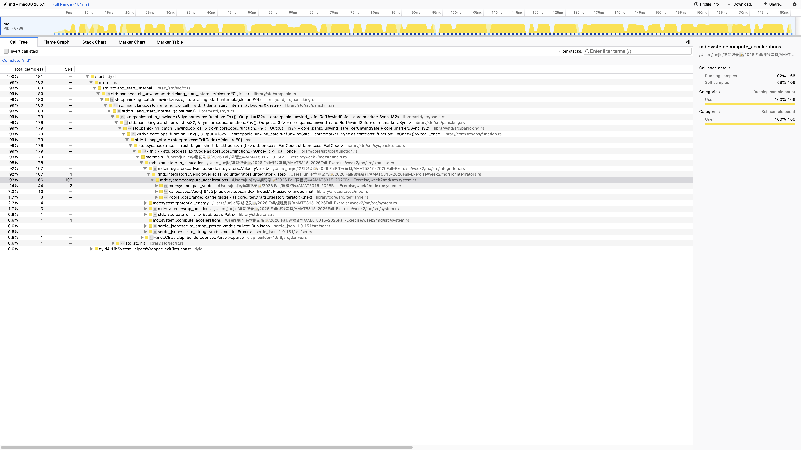

# Week 2: Molecular dynamics

Simulator crate: `md/`. From this directory, `make reproduce` runs the default \(N=100\) fluid.

Install the release binary (with debug info for `samply`) onto `PATH`:

```bash
cargo install --path md --force
```

## Timing

Contract run (\(N=100\), 2000 equilibration + 10000 production steps). Three wall-clock runs each; median and min–max. Debug is `cargo build` then `./md/target/debug/md`. Release is the installed `md`. NumPy is `week2-sim.py` in conda env `modernSC`.

```bash
/usr/bin/time -p conda run -n modernSC python week2-sim.py
cargo build --manifest-path md/Cargo.toml
/usr/bin/time -p ./md/target/debug/md run --out /tmp/md-debug
/usr/bin/time -p md run --out /tmp/md-release
```

| Program | Median (s) | Range: min–max (s) |
| --- | ---: | ---: |
| NumPy week2-sim.py | 4.14 | 4.05–6.31 |
| Rust debug | 2.05 | 2.05–2.52 |
| Rust release | 0.13 | 0.13–0.13 |

Release is well under one third of debug. On this machine the release Rust also beats NumPy.

## Profile

\(N=400\), `--eq-steps 200 --steps 1000`. Naive all-pairs forces. Force share is samples in `compute_accelerations` and its callees.

```bash
samply record --save-only -o /tmp/md-naive-profile.json -- md run --n 400 --eq-steps 200 --steps 1000 --out /tmp/md-prof
samply load /tmp/md-naive-profile.json
```

| Version | Force share (%) | Elapsed time (s) |
| --- | ---: | ---: |
| Naive | 92 | 0.18 |
| Cell list | … | … |



The hot spot is `md::system::compute_accelerations` (all-pairs search). That is the next optimization target.
